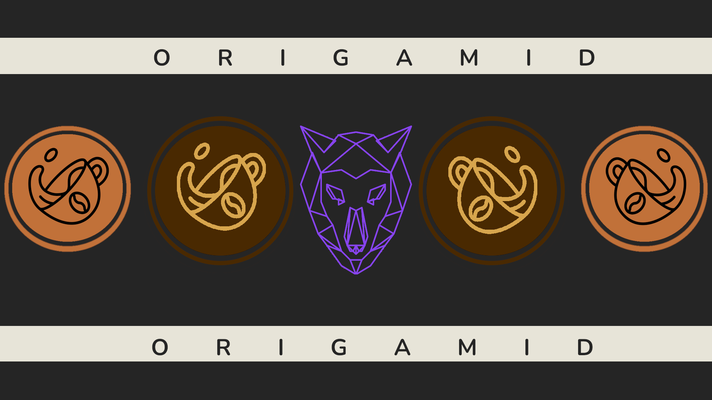

<h1 style="font-weight: bold; margin-top: 5px; text-align: center; border: none;"> Origamid: Projetos Brafé</h1>

O repositório em questão contém 3 _layouts_ diferentes de uma página fictícia de venda de cafés chamada "Brafé". Que são desenvolvidas no curso da Origamid chamado "CSS Avançado - Posicionamento".  
O curso foca em desenvolver o mesmo _layout_ de 4 formas diferentes (sendo todas elas responsivas) que são:

- Puro
  - Se trata de não utilizar grids, flexbox, bootstrap e grid tempplates
- Grid
  - Utilizando suas próprias grids de 12 colunas criadas do zero
- FlexBox
  - Usando o display flexbox nos containers
- Bootstrap
  - Usufruindo de classes prontas do bootstrap

## **Brafé 1**

> Pasta: CSS Puro, Grid, Flexbox, Bootstrap - Brafe \_1
>  

 

## **Brafé 2**

> Pasta: CSS Puro, Grid, Flexbox, Bootstrap - Brafe \_2
>  

 

## **Brafé 3**

> Pasta: CSS Puro, Grid, Flexbox, Bootstrap - Brafe \_3
>  

 
